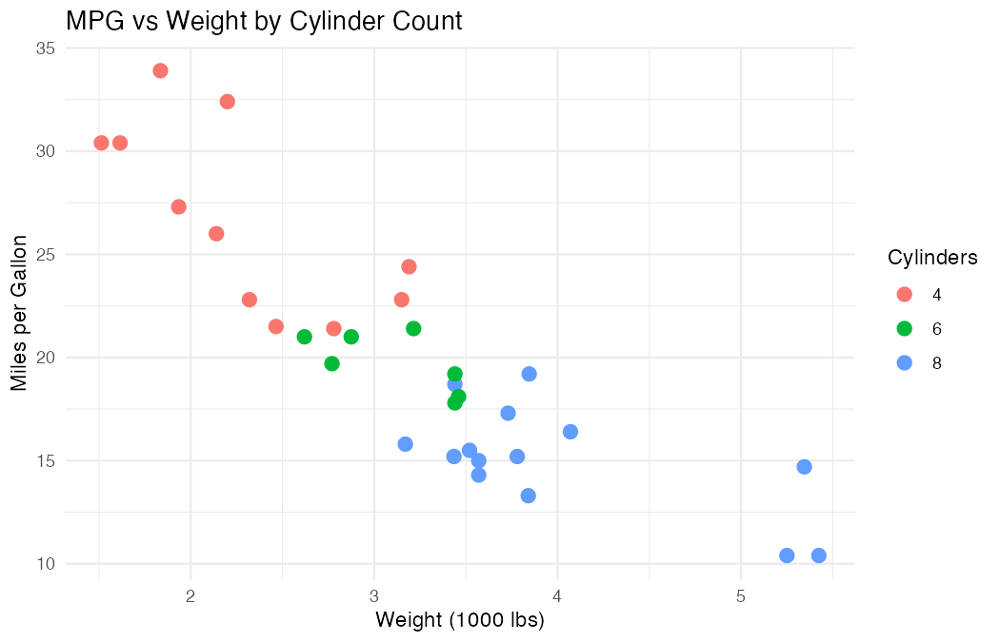

# Getting R Running in Snowflake Workspaces with rpy2

*Part 1 of the "R in Snowflake" series -- building a "first-class" R integration
with the snowflakeR package*

---

> **Heads up:** The `snowflakeR` package described in this series is a passion
> project that gives R users an idiomatic interface to the
> `snowflake-ml-python` SDK and Snowflake's server-side ML capabilities --
> including the Model Registry, Feature Store, and Snowpark -- enabling
> end-to-end ML workflows from R that are fully interoperable with Python.
> It is **not yet officially supported by Snowflake**, but is developed and
> provided to help customers use R within Snowflake Workspaces and Containers,
> and to solicit feedback that will help improve product integration for R
> users. APIs and capabilities may change as the package evolves. If you'd
> like to try it, contribute, or share feedback, the
> [GitHub repo](https://github.com/Snowflake-Labs/snowflakeR) is the place.

---

R remains one of the most popular languages for statistical computing and data
science, backed by a rich ecosystem of over 20,000 packages on CRAN. Snowflake is
increasingly the data platform of choice for organisations of all sizes. But using
R *inside* Snowflake has always required workarounds.

In this series, I'll show how the `snowflakeR` package brings R into Snowflake
Workspaces with a deep, idiomatic integration -- covering data access, feature
engineering, and model deployment -- all from R, all inside Snowflake.

In this first post, we'll get a working R environment up and running in a
Snowflake Workspace Notebook, install the `snowflakeR` package, and take it
through a quickstart covering queries, table operations, dplyr, and
visualisation. By the end you'll have a solid foundation for the rest of the
series.

## The R + Snowflake Landscape Today

R users have several ways to work with Snowflake today:

- **ODBC/JDBC connections** from RStudio, Posit Workbench, or JupyterLab
- **dplyr + dbplyr** for writing R code that gets translated to SQL and pushed
  down to Snowflake for execution -- I wrote about this approach
  [using Hex's R support](https://medium.com/snowflake/using-hexs-new-r-support-with-snowflake-ff6c7a107cd6)
  back in 2023
- **Model export** via PMML or ONNX for deployment
- **Custom Docker containers** with plumber REST APIs -- Mats Stellwall demonstrated
  this in [Running a R UDF with Snowpark Container Services](https://medium.com/snowflake/running-a-r-udf-with-snowpark-container-services-5828d1380066)
- **Python subprocess wrappers** -- Kaitlyn Wells showed how to wrap R models using
  a Python `CustomModel` in [Deploying R Models in Snowflake's Model Registry](https://medium.com/snowflake/deploying-r-models-in-snowflakes-model-registry-effcf04dd85c)

All of these work, but none provide an integrated R development experience
*within* Snowflake's own compute environment. You could use Snowflake data from
R, or deploy R models to Snowflake with varying degrees of effort, but you
couldn't develop and iterate in R inside Snowflake.

**What changed?** [Snowflake Workspaces](https://docs.snowflake.com/en/user-guide/ui-snowsight/notebooks)
-- notebook environments running on Snowpark Container Services -- provide a full
Linux container with Python. And where there's Python, there's a path to R.

Reading Kaitlyn's blog about calling R from Python via subprocess, I realised
that **rpy2** and **reticulate** could provide a much deeper integration -- not
just for model serving, but for the entire data science workflow. That insight was the 
inspiration that led to the `snowflakeR` package.

## What Is rpy2, and Why Does It Matter Here?

[rpy2](https://rpy2.github.io/) is a mature (15+ years) Python package that
embeds a full R interpreter within the Python process. It enables calling R
functions from Python, passing data bidirectionally, and -- critically for us --
using the `%%R` cell magic in Jupyter/IPython notebooks.

The key insight for Snowflake is this: **Workspace Notebooks run a Python
kernel.** With rpy2, we get a full R session inside that kernel. Combined with
[reticulate](https://rstudio.github.io/reticulate/) (R's bridge back to Python),
we can call the `snowflake-ml-python` SDK from R. That gives us access to
Snowflake's Model Registry, Feature Store, Snowpark -- everything -- from R.

**How it works in practice:** Workspace Notebooks only support Python cells --
there's no R kernel option (yet). But that doesn't matter. When you start a cell
with `%%R`, you're using an IPython "cell magic" that tells the Python kernel:
"don't execute this cell as Python -- hand it to rpy2, which will execute it as
R." The cell contents are pure R code; rpy2 passes it to the embedded R
interpreter, runs it, and returns any output or plots back to the notebook. To
you as the user, it feels exactly like writing in an R notebook -- the fact that
a Python kernel is orchestrating things behind the scenes is an implementation
detail you can largely ignore.

The `snowflakeR` package wraps all of this into an idiomatic R API. You call R
functions; under the hood, reticulate calls the Python SDK; the results come
back as R data.frames. You never have to write Python.

Here's the architecture:

```
┌────────────────────────────────────────────────────────┐
│              Snowflake Workspace Notebook              │
│                                                        │
│   ┌───────────────┐      ┌──────────────────────────┐  │
│   │ Python Kernel │◄────►│   R Session (micromamba) │  │
│   │               │ rpy2 │                          │  │
│   │   %%R magic   │      │    ┌──────────────────┐  │  │
│   │               │      │    │    snowflakeR    │  │  │
│   └──────┬────────┘      │    │  (idiomatic R)   │  │  │
│          │               │    │        │         │  │  │
│          │               │    │   reticulate     │  │  │
│          │               │    │   (R → Python)   │  │  │
│          │               │    └────────┬─────────┘  │  │
│          │               └─────────────┼────────────┘  │
│   ┌──────▼─────────────────────────────▼───────────┐   │
│   │         snowflake-ml-python SDK                │   │
│   │   (Model Registry, Feature Store, Snowpark)    │   │
│   └────────────────────┬───────────────────────────┘   │
│                        │                               │
│                        ▼                               │
│   ┌────────────────────────────────────────────────┐   │
│   │              Snowflake Platform                │   │
│   │   (Warehouses, Feature Store, Model Registry)  │   │
│   └────────────────────────────────────────────────┘   │
└────────────────────────────────────────────────────────┘
```

How does this compare with the alternative approaches?

| | Subprocess (Kaitlyn) | Docker/plumber (Mats) | rpy2/snowflakeR |
|---|---|---|---|
| **Interop** | File-based (CSV) | HTTP/JSON | In-process (shared memory) |
| **Overhead** | High (process spawn + serialise) | Medium (REST calls) | Low (direct function calls) |
| **Per-model work** | R script + Python wrapper | Dockerfile + plumber API | One function call |
| **Dev experience** | Write Python + R separately | Docker knowledge needed | Pure R |
| **Scope** | Inference only | Inference only | Full workflow |

Each approach has its place. The subprocess method gives maximum control. The
Docker approach is the most flexible (any language, any framework). The
rpy2/snowflakeR approach prioritises developer experience -- you stay in R for
the entire workflow.

## Setting Up R in a Snowflake Workspace

Setting up R in a Workspace currently involves three steps. I say "currently"
because some of these steps may become unnecessary in future Workspace runtime
images where R, rpy2 and other pre-requisites are pre-installed. The install script is
designed to be idempotent, so it will gracefully skip already-installed components when that
happens. 

### Step 1: Install R and Packages

The `snowflakeR` package ships with an install script
(`setup_r_environment.sh`) that handles everything:

```python
# Run in a Python cell in your Workspace Notebook
!bash setup_r_environment.sh --basic
```

Everything is installed into user-space -- **no `sudo` or root access is
required** (or available in a Workspace container). Nothing touches the system
Python environment or container base image. Under the hood, this script:

1. **Installs micromamba** -- a fast, lightweight conda-compatible package manager.
   We use micromamba rather than full conda/mamba because it's a single static
   binary that downloads quickly and has no dependencies. It installs into your
   home directory.

2. **Creates an isolated R environment** called `r_env` with R and packages from
   conda-forge, all under `~/micromamba/envs/`. The packages are declared in
   `r_packages.yaml`:

```yaml
r_version: ""  # Leave empty for latest

conda_packages:
  - r-tidyverse         # dplyr, ggplot2, tidyr, etc.
  - r-dbplyr            # Database backend for dplyr
  - r-lazyeval          # Required for some tidyverse operations
  - r-reticulate>=1.25  # R-Python interop (>=1.25 required)
```

3. **Fixes library symlinks** -- a container-specific quirk where `libz.so` and
   `liblzma.so` need symlinking for R to load packages correctly.

> **A note for commercial users:** Everything installed by this script is
> freely-licensed open-source software, installed entirely in user-space with
> no elevated privileges. **micromamba** is licensed under BSD-3-Clause and is
> developed by the [mamba-org](https://github.com/mamba-org) community -- it is
> *not* affiliated with Anaconda, Inc. and is not subject to Anaconda's
> commercial Terms of Service. All packages are sourced from
> **[conda-forge](https://conda-forge.org/)**, a community-driven, open-source
> collection of packages maintained under permissive/open licenses -- entirely
> separate from Anaconda's default repository. R itself is GPL-licensed, and
> CRAN packages carry their own open-source licenses (typically GPL, MIT, or
> Apache-2.0). Nothing modifies the container base image or system environment
> -- you can use all of this freely in commercial settings.

You can customise `r_packages.yaml` to add any R packages you need installed
into the Workspace for your project. The `conda_packages` section installs from
conda-forge (fastest, preferred for packages with compiled code), and there's
also a `cran_packages` section for packages only available on CRAN.

#### Installing packages interactively

You can also install packages on-the-fly from within an R cell, just as you
would in any R session. But -- Workspace Notebooks have **no interactive stdin**,
so anything that prompts for user input will hang. And compilation from source
produces a lot of output you probably don't want filling your notebook. Here's
the pattern we use in the quickstart notebooks to keep things clean:

```r
%%R
# 1. Set the CRAN mirror (avoids the mirror-selection prompt)
options(repos = c(CRAN = "https://cloud.r-project.org"))

# 2. Force source install + suppress compilation chatter
install.packages("forecast", type = "source", quiet = TRUE)

# 3. Suppress the startup banner when loading
suppressPackageStartupMessages(library(forecast))
```

Why each of these matters:

- **`options(repos = ...)`** -- Without this, R prompts you to choose a CRAN
  mirror. That prompt blocks forever in a Notebook because there's no stdin.
  Our setup cells set this once at the top, but if you're running an ad-hoc
  cell you'll need to include it.
- **`type = "source"`** -- The Workspace container is Linux and CRAN doesn't
  provide Linux binaries for most packages. Without this flag, R may prompt
  "There is a binary version available but the source version is later. Do you
  want to install from sources?" -- another hanging prompt. Specifying
  `type = "source"` skips the question entirely.
- **`quiet = TRUE`** -- Source compilation produces verbose output (compiler
  flags, warnings, progress lines) that floods the notebook cell. `quiet = TRUE`
  suppresses all of this, giving you a clean cell output.
- **`suppressPackageStartupMessages()`** -- Many packages print startup banners,
  version info, or attached-package messages when loaded. Wrapping `library()`
  in `suppressPackageStartupMessages()` keeps your notebook tidy.

If you're installing a package that has its own interactive prompts (e.g.,
`pak::pak()` asking whether to update dependencies), look for an `ask = FALSE`
or `upgrade = "never"` argument to disable the prompt:

```r
%%R
pak::pak("tidymodels/tidymodels", ask = FALSE, upgrade = FALSE)
```

A few more things to be aware of:

- **R package dependencies are handled automatically.** `install.packages()`
  resolves the dependency tree and installs any missing R packages from CRAN,
  just like on your desktop. No surprises there.
- **System library dependencies can bite you.** Some R packages with compiled
  code link against system-level C/C++ libraries (e.g., `sf` needs `libgdal`,
  `curl` needs `libcurl-dev`, `openssl` needs `libssl-dev`). If these shared
  libraries aren't in the container, `install.packages()` will fail at the
  `./configure` or compilation step with errors like "library not found" or
  "cannot find -lgdal". You don't have `apt-get` or root access in a Workspace
  container, so you can't install system libraries yourself. **This is the
  biggest reason to prefer conda-forge packages** -- when you install
  `r-sf` from conda-forge, it bundles `libgdal`, `libproj`, `libgeos`, and
  everything else `sf` needs. CRAN's `install.packages("sf")` expects you to
  provide those yourself.
- **Packages compile from source** on the Linux container, so even when system
  deps are satisfied, packages with C/C++/Fortran code (e.g., `data.table`) are
  slower to install than you're used to. Adding the conda-forge equivalent
  (e.g., `r-data.table`) to `r_packages.yaml` is faster since conda-forge
  provides pre-compiled binaries.
- **Packages don't persist** across container recycles, same as the R environment
  itself. For packages you use regularly, add them to `r_packages.yaml` so
  they're installed automatically with the setup script.

As a rule of thumb: use `install.packages()` for pure-R packages or quick
experimentation, and use conda-forge (via `r_packages.yaml`) for anything with
compiled code or system library dependencies.

#### Install script modes

The script supports several modes:
- `--basic` : R + packages from the YAML config (default)
- `--adbc` : Also installs the ADBC Snowflake driver for direct database access
- `--full` : R + ADBC + DuckDB with Snowflake extension

**Tip:** The script is idempotent. It checks what's already installed and skips
those steps. You can re-run it freely to add packages (edit `r_packages.yaml`
first) or use `--force` to reinstall everything from scratch.

**Tip:** The first-time installation takes about 3 minutes. If your Workspace
container is recycled after inactivity, you'll need to re-run it, but subsequent
runs are much faster.

### Step 2: Configure rpy2 and Register the %%R Magic

Steps 2 and 3 are the only Python cells you'll need to run. They bootstrap the
R environment and register the `%%R` magic -- after that, everything is pure R.
We promised you wouldn't need to write Python, and we meant it: these are
copy-paste setup cells that you run once and forget about.

A Python helper module (`r_helpers.py`) handles the rpy2 configuration:

```python
from r_helpers import setup_r_environment
result = setup_r_environment()

if result['success']:
    print(f"R {result['r_version']} ready. %%R magic registered.")
else:
    print("Setup failed:", result['errors'])
```

This function:
- Sets `PATH` and `R_HOME` environment variables to point to the micromamba R
  installation
- Installs `rpy2` into the notebook's Python environment
- Registers the `%%R` cell magic so you can write R code directly in notebook
  cells
- Configures R console width for better output formatting in notebooks

### Step 3: Install and Load snowflakeR

The `snowflakeR` package is currently installed from source (the repo cloned
into your Workspace). Once it's published to GitHub, you'll be able to install
it with `pak::pak("Snowflake-Labs/snowflakeR")`.

First, resolve the path to the package (last Python cell, I promise):

```python
import os
snowflaker_path = os.path.normpath(os.path.join(os.getcwd(), "..", ".."))
os.environ["SNOWFLAKER_PATH"] = snowflaker_path
```

Then install and load (in an `%%R` cell):

```r
%%R
options(repos = c(CRAN = "https://cloud.r-project.org"))

# Install dependencies and snowflakeR from local source
try(remove.packages("snowflakeR"), silent = TRUE)
install.packages(Sys.getenv("SNOWFLAKER_PATH"), repos = NULL, type = "source")
library(snowflakeR)
```

You should see:

```
snowflakeR 0.1.0 - R interface to the Snowflake ML platform
```

That's it. Three steps, and you have a fully functional R environment inside
Snowflake with access to the ML platform. From here on, it's all `%%R` cells --
no more Python.

## Quickstart: Hello Snowflake from R

Let's take `snowflakeR` for a spin. Everything from here on is pure R.
This section corresponds to the `workspace_quickstart.ipynb` notebook that ships
with the package, so you can follow along cell by cell.

### Connect to Snowflake

```r
%%R
# Connect (auto-detects Workspace session)
conn <- sfr_connect()

# Load config and set execution context
conn <- sfr_load_notebook_config(conn)
conn
```

`sfr_connect()` auto-detects that it's running inside a Workspace Notebook and
wraps the active Snowpark session. No credentials needed -- the Workspace session
is already authenticated.

`sfr_load_notebook_config()` reads `notebook_config.yaml` and runs
`USE WAREHOUSE / DATABASE / SCHEMA` to set the execution context. This is
important because Workspace Notebooks don't auto-set database or schema the way
Snowsight worksheets do. You need to copy `notebook_config.yaml.template` to
`notebook_config.yaml` and edit it with your values before running.

The output shows your connection details:

```
<sfr_connection> [workspace]
  account   : "xy12345"
  user      : "MYUSER"
  database  : "MY_DB"
  schema    : "MY_SCHEMA"
  warehouse : "MY_WH"
  role      : "MY_ROLE"
```

**Important:** `sfr_load_notebook_config()` returns a *new* connection object
with the updated context. R is pass-by-value, so you must reassign:
`conn <- sfr_load_notebook_config(conn)`. The same applies to `sfr_use()`.

### Run a Query

```r
%%R
result <- sfr_query(conn, "SELECT CURRENT_TIMESTAMP() AS now, CURRENT_USER() AS user_name")
rprint(result)
```

`sfr_query()` runs SQL and returns an R data.frame. Column names are lowercased
by default for R-friendliness (Snowflake returns UPPERCASE). You can pass
`.keep_case = TRUE` if you need the original casing.

You'll notice we used `rprint()` instead of plain `print()`. Workspace Notebooks
add extra line breaks to R cell output, making multi-line output harder to read.
The `snowflakeR` package includes several output helpers that produce clean
formatting:

- `rprint(x)` -- print any R object cleanly
- `rview(df, n)` -- view a data.frame with an optional row limit
- `rglimpse(df)` -- tibble-style glimpse of a data.frame structure
- `rcat(...)` -- clean replacement for `cat()`

### Write and Read Data

Let's round-trip R's built-in `mtcars` dataset through Snowflake:

```r
%%R
# Write mtcars to Snowflake
sfr_write_table(conn, sfr_fqn(conn, "SFR_MTCARS"), mtcars, overwrite = TRUE)
```

`sfr_fqn()` constructs a fully qualified table name (`DB.SCHEMA.TABLE`) from the
connection context. This is a good practice for Workspace Notebooks where the
context can be ambiguous. By default it uses the connection's current database
and schema, but you can override either when you need to reference objects
elsewhere:

```r
# Default -- uses connection's current database/schema
sfr_fqn(conn, "SFR_MTCARS")
# => "MY_DB.MY_SCHEMA.SFR_MTCARS"

# Override schema (same database)
sfr_fqn(conn, "SOME_TABLE", schema = "RAW_DATA")
# => "MY_DB.RAW_DATA.SOME_TABLE"

# Override both database and schema
sfr_fqn(conn, "SOME_TABLE", database = "OTHER_DB", schema = "STAGING")
# => "OTHER_DB.STAGING.SOME_TABLE"
```

```r
%%R
# Read it back
df <- sfr_read_table(conn, sfr_fqn(conn, "SFR_MTCARS"))
rview(df, n = 5)
```

```
   mpg cyl disp  hp drat    wt  qsec vs am gear carb
1 21.0   6  160 110 3.90 2.620 16.46  0  1    4    4
2 21.0   6  160 110 3.90 2.875 17.02  0  1    4    4
3 22.8   4  108  93 3.85 2.320 18.61  1  1    4    1
4 21.4   6  258 110 3.08 3.215 19.44  1  0    3    1
5 18.7   8  360 175 3.15 3.440 17.02  0  0    3    2
[Showing 5 of 32 rows x 11 cols]
```

### Explore the Database

```r
%%R
# List tables in the current schema
tables <- sfr_list_tables(conn)
rcat("Tables: ", paste(head(tables, 10), collapse = ", "))

# Describe columns
sfr_list_fields(conn, sfr_fqn(conn, "SFR_MTCARS")) |> rprint()
```

### DBI Integration

Here's something important: the `sfr_connection` object is also a standard R
**DBI connection**. That means the entire DBI ecosystem works out of the box:

```r
%%R
library(DBI)

DBI::dbGetQuery(conn, "SELECT 42 AS answer") |> rprint()
DBI::dbExistsTable(conn, sfr_fqn(conn, "SFR_MTCARS"))
```

You don't have to choose between `snowflakeR` functions and DBI -- use
whichever feels more natural for the task at hand. The DBI compatibility also
means that `dbplyr` works directly, which is what we'll use next.

### dplyr + dbplyr: Write R, Execute in Snowflake

This is where things get really interesting. With `dplyr` and `dbplyr`, you can
write standard R data manipulation code that gets automatically translated to
SQL and executed inside Snowflake. No data leaves Snowflake until you call
`collect()`.

```r
%%R
library(dplyr)
library(dbplyr)

# Create a lazy reference to the Snowflake table
cars_tbl <- tbl(conn, I(sfr_fqn(conn, "SFR_MTCARS")))

# Build a dplyr pipeline -- this generates SQL, nothing executes yet
summary <- cars_tbl |>
  group_by(cyl) |>
  summarise(
    n       = n(),
    avg_mpg = mean(mpg, na.rm = TRUE),
    avg_hp  = mean(hp, na.rm = TRUE)
  ) |>
  arrange(cyl) |>
  collect()  # NOW it executes in Snowflake and returns the result

rprint(summary)
```

```
  cyl  n  avg_mpg    avg_hp
1   4 11 26.66364  82.63636
2   6  7 19.74286 122.28571
3   8 14 15.10000 209.21429
```

A few things to note:

- `tbl(conn, I(...))` creates a lazy reference. The `I()` wrapper prevents
  dbplyr from quoting the fully-qualified name incorrectly.
- All the dplyr operations (`group_by`, `summarise`, `arrange`) build up a SQL
  query but don't execute it.
- `collect()` triggers execution in Snowflake and pulls the result into R.

You can see the generated SQL with `show_query()`:

```r
%%R
cars_tbl |>
  group_by(cyl) |>
  summarise(n = n(), avg_mpg = mean(mpg, na.rm = TRUE)) |>
  show_query()
```

If you've read my
[Hex + Snowflake blog](https://medium.com/snowflake/using-hexs-new-r-support-with-snowflake-ff6c7a107cd6),
this will look familiar -- the dplyr pushdown pattern is the same. The big
difference is that we're now running from *inside* Snowflake rather than from an
external tool. We'll explore the data interop patterns much more deeply in the
next post in this series.

### Visualisation with ggplot2

Finally, let's make a chart. In Workspace Notebooks, you need to use the
`%%R -w WIDTH -h HEIGHT` magic parameters to control the plot size, and you must
explicitly call `print(p)` on the plot object:

```r
%%R -w 700 -h 450
library(ggplot2)

df <- sfr_read_table(conn, sfr_fqn(conn, "SFR_MTCARS"))

p <- ggplot(df, aes(x = wt, y = mpg, color = factor(cyl))) +
  geom_point(size = 3) +
  labs(title = "MPG vs Weight by Cylinder Count",
       x = "Weight (1000 lbs)", y = "Miles per Gallon",
       color = "Cylinders") +
  theme_minimal()

print(p)  # print() is required in Workspace Notebooks
```



The full `ggplot2` library is available (installed via `r-tidyverse`), so you can
create any visualisation you'd normally build in R, directly from Snowflake data.

## Gotchas & Tips

Here are the practical things I've learned while building and using this
integration. I'll include relevant gotchas in every post in the series.

**reticulate >= 1.25 is required.** Older versions of the R `reticulate` package
have a bug that causes a segfault when rpy2 and reticulate are both loaded. The
`r_packages.yaml` config pins `r-reticulate>=1.25` to avoid this. If you see
warnings about reticulate and rpy2 compatibility, check your version.

**Workspace Notebooks don't auto-set database/schema.** Always use
`sfr_load_notebook_config()` or `sfr_use()` after connecting, and use
`sfr_fqn(conn, "TABLE")` for fully qualified table names.

**Output formatting.** Use `rprint()`, `rview()`, `rglimpse()`, and `rcat()`
instead of base R's `print()` and `cat()` for clean output in Workspace
Notebooks. We expect a future Workspace Notebook iteration to address the
underlying R output rendering, at which point these helpers will become
unnecessary -- but they'll remain in the package for backwards compatibility.

**Plot display.** Use `%%R -w 700 -h 450` (or your preferred size) and always
call `print(p)` on ggplot objects. Without the explicit `print()` call, plots
won't render.

**The install script is idempotent.** Re-run `setup_r_environment.sh` freely --
it checks what's installed and skips those steps. Edit `r_packages.yaml` to add
packages, then re-run. Use `--force` to reinstall everything.

**install.packages() -- suppress prompts and noise.** Workspace Notebooks have
no stdin, so any interactive prompt hangs forever. Always use
`options(repos = ...)` (mirror prompt), `type = "source"` (binary-vs-source
prompt), and `quiet = TRUE` (compilation chatter). Wrap `library()` calls in
`suppressPackageStartupMessages()` for clean output. See the "Installing
packages interactively" section above for the full pattern.

**Container recycling.** If your Workspace has been idle for a while, the
container may have been recycled. Re-run the setup cells (Steps 1-3) to get
back to a working state. The R package cache in micromamba makes this faster
than the first run. Packages installed via `install.packages()` during the
session won't survive a recycle either -- add them to `r_packages.yaml` for
persistence.

**Check your environment.** If things aren't working, run
`sfr_check_environment()` for a quick diagnostic:

```r
%%R
sfr_check_environment()
```

This checks R, Python, reticulate, and snowflake-ml-python availability and
reports any issues.

## Sneak Peek: Passing Data Between Python and R

Before we wrap up, one more thing worth knowing. Since `%%R` cells run inside a
Python kernel, you can pass variables back and forth between Python and R using
the `-i` (input) and `-o` (output) flags on the `%%R` magic. You won't need
this often -- `snowflakeR` handles the bridge internally -- but it's useful to
know it's there.

**Python → R** with `-i` (input): push a Python variable into the R session.

```python
# Python cell
import pandas as pd
py_df = pd.DataFrame({"x": [1, 2, 3], "y": [4, 5, 6]})
```

```r
%%R -i py_df
# py_df is now an R data.frame
rprint(py_df)
```

**R → Python** with `-o` (output): pull an R variable back into Python.

```r
%%R -o r_result
r_result <- data.frame(model = "lm", rmse = 2.34, r_squared = 0.87)
```

```python
# Python cell -- r_result is now a pandas DataFrame
print(r_result)
```

This works for data.frames, vectors, and scalars. The rpy2/reticulate bridge
handles the type conversion automatically. We'll explore these patterns in
depth in the next post, including performance considerations for larger
datasets and more complex data structures.

## Summary

In this post we:

- Introduced **rpy2** as the bridge technology that enables R inside Snowflake
  Workspace Notebooks
- Set up a complete **R environment** in a Workspace in three steps
- Installed and loaded the **snowflakeR** package
- Connected to Snowflake and ran **SQL queries** from R
- **Wrote and read data** to/from Snowflake tables
- Used **DBI** for standard R database access
- Got a first taste of **dplyr + dbplyr** pushdown
- Created a **ggplot2 visualisation** from Snowflake data
- Saw how to **pass data between Python and R** cells with `-i` and `-o`

All of this from R, inside Snowflake, with no Python code in sight (after the
initial setup).

## What's Next

In the next post, we'll go deep on **data interop** -- the multiple ways to
move data between R, Python, and Snowflake. We'll compare SQL, dplyr pushdown,
and Snowpark DataFrames, look at performance characteristics, and cover the
DataFrame conversion patterns that make it all seamless. If you've used dplyr
with databases before (from Hex, RStudio, or anywhere else), you'll feel right
at home -- but now from inside Snowflake.

---

**Resources:**
- [GitHub: snowflakeR](https://github.com/Snowflake-Labs/snowflakeR)
- Companion notebook: `snowflakeR/inst/notebooks/workspace_quickstart.ipynb`
- Package vignette: `vignette("workspace-notebooks", package = "snowflakeR")`
  -- covers the full Workspace setup, `%%R` magic patterns, `-i`/`-o` data
  exchange, output helpers, PAT management, and troubleshooting in detail.
- Setup & prerequisites: `vignette("setup", package = "snowflakeR")` -- covers
  local environments (RStudio, VS Code, Jupyter), authentication options, and
  Python environment configuration.

**Prior art (referenced in this post):**
- [Kaitlyn Wells: Deploying R Models in Snowflake's Model Registry](https://medium.com/snowflake/deploying-r-models-in-snowflakes-model-registry-effcf04dd85c)
- [Mats Stellwall: Running a R UDF with Snowpark Container Services](https://medium.com/snowflake/running-a-r-udf-with-snowpark-container-services-5828d1380066)
- [Simon Field: Using Hex's new R support with Snowflake](https://medium.com/snowflake/using-hexs-new-r-support-with-snowflake-ff6c7a107cd6)

---

*Tags: R, Snowflake, rpy2, Data Science, Snowpark Container Services*
